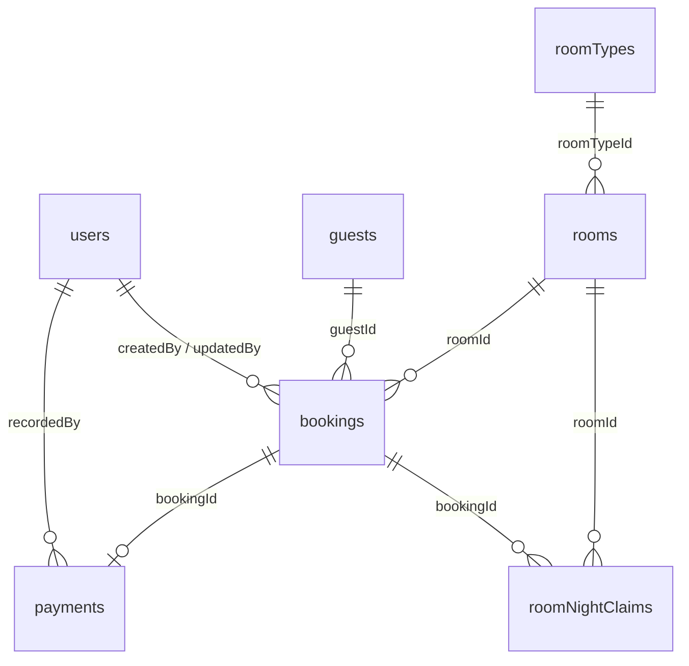

# Step 2 — ออกแบบ Collections และข้อมูลตัวอย่าง

สถานะ: แบบออกแบบเพื่อ review ก่อนลงมือสร้าง Prisma models และ seed ใน Step 4  
แหล่งอ้างอิง: PDF “แผนพัฒนา Web App ระบบจัดการห้องโรงแรม — ทีม 5 คน” หน้า 1–4, 6–9 และโค้ดปัจจุบันใน `server/prisma/schema.prisma`  
ข้อมูลประกอบ: [`step2-sample-data.json`](./step2-sample-data.json)

## 1. ขอบเขตและข้อตกลง

- MVP มีผู้ใช้ `admin` และ `receptionist`; ครอบคลุม room type, room, guest, booking, check-in/out และการชำระเงินพื้นฐาน
- `admin` เพิ่ม/แก้/ลบประเภทห้องและห้อง รวมถึงจัดการ users; `receptionist` อ่าน/ค้นหาห้อง จัดการ guest และ booking/check-in/out/payment ได้ตาม flow ใน PDF
- ฐานข้อมูลที่โปรเจกต์ตั้งไว้แล้วคือ MongoDB ผ่าน Prisma 6; เอกสาร PDF กล่าวถึง Mongoose/Atlas ด้วย แต่ Step 2 นี้ยึด stack ที่อยู่ใน repository ปัจจุบัน การย้ายไป Atlas เป็นการเปลี่ยน connection ไม่ใช่แบบข้อมูล
- ชื่อ collection ใช้พหูพจน์ตามรายการใน PDF (`users`, `roomTypes`, `rooms`, `guests`, `bookings`, `payments`) และเพิ่ม `roomNightClaims` เพื่อบังคับไม่ให้จองห้องซ้ำในระดับฐานข้อมูล
- รหัสอ้างอิงเป็น MongoDB ObjectId (`String @db.ObjectId` ใน Prisma); ตัวอย่างใน JSON ใช้สตริง hex 24 ตัวเพื่อให้อ่านง่าย ต้องแปลงเป็น ObjectId ตอน seed
- วันที่เข้าพัก/ออกพักเป็น **วันปฏิทินของโรงแรม** รูปแบบ `YYYY-MM-DD` ไม่ใช่ timestamp; ช่วงจองคือ `[checkInDate, checkOutDate)` เช่น 10–12 ต.ค. ใช้คืนวันที่ 10 และ 11 ห้องเดิมจองต่อเริ่มวันที่ 12 ได้
- เวลาเหตุการณ์ (`createdAt`, `paidAt`, `actualCheckInAt` ฯลฯ) เก็บเป็น UTC timestamp; แสดงผลตาม timezone ของโรงแรมที่ตั้งในแอป
- ราคา `basePrice` และ `totalPrice` เป็นจำนวนเต็มหน่วย **บาท** ใน MVP เพื่อไม่ให้เกิดข้อผิดพลาดจากทศนิยม หากต้องรองรับสตางค์ ให้เปลี่ยนทั้งระบบเป็นจำนวนเต็มหน่วยสตางค์ก่อนมีข้อมูลจริง ห้ามผสมสองหน่วย
- โครงสร้างนี้เป็นข้อเสนอสำหรับ review และ **ยังไม่ได้แก้ schema หรือสร้างข้อมูลในฐานข้อมูล**; Step 4 จึงค่อยทำ model, index และ seed จริง

## 2. ความสัมพันธ์

| ความสัมพันธ์ | กติกา |
|---|---|
| `roomTypes` 1:N `rooms` | ห้องต้องอ้างประเภทที่มีอยู่และยังใช้งานได้เมื่อสร้าง/เปลี่ยนประเภท |
| `guests` 1:N `bookings` | 1 booking มีผู้จองหลัก 1 คน; `roomTypes.capacity` จำกัดจำนวนผู้พัก (`guestCount`) |
| `rooms` 1:N `bookings` | 1 booking จอง 1 ห้องต่อช่วงวัน; ต้องตรวจการจองทับซ้อน |
| `bookings` 1:0..1 `payments` | รายการชำระเงิน 1 รายการเป็นยอดสรุปของ booking; booking ที่ยกเลิกก่อนชำระอาจไม่มี payment |
| `bookings` 1:N `roomNightClaims` | 1 claim ต่อ 1 คืน; unique `(roomId, night)` เป็นตัวกัน double booking |
| `users` 1:N รายการสำคัญ | เก็บ `createdById`/`updatedById` หรือ `recordedById` เพื่อ audit; ปิดบัญชีผู้ใช้แทนลบเมื่อมีประวัติ |

ObjectId ที่อ้างอิงต้องตรวจว่ามีเอกสารปลายทางจริงใน service เพราะ MongoDB ไม่บังคับ foreign key เอง ห้ามลบ room type, room หรือ guest ที่มี booking อ้างอยู่; ให้เพิ่ม `active: false`/`archivedAt` ในอนาคตหรือปฏิเสธการลบ

## 3. Collections และ validation

ทุก collection หลักมี `_id`, `createdAt`, `updatedAt` เว้นแต่ `roomNightClaims` ซึ่งเป็นข้อมูลประกอบและมี `createdAt` เท่านั้น ข้อมูลจาก client ห้ามกำหนด `_id`, audit fields หรือ status ที่เกิดจากระบบเองโดยตรง

### `users`

| ฟิลด์ | ชนิด / กติกา |
|---|---|
| `_id` | ObjectId |
| `name` | string, trim, 1–120 ตัวอักษร, required |
| `email` | string, trim + lowercase, รูปแบบอีเมล, required, unique |
| `passwordHash` | string bcrypt hash, required; ห้ามเก็บ password จริงหรือคืน hash ใน API |
| `role` | enum `admin`, `receptionist`, required |
| `active` | boolean, default `true`; login ได้เฉพาะบัญชี active |
| `createdAt`, `updatedAt` | UTC timestamp, required |

กฎธุรกิจ: เปลี่ยนสิทธิ์/ปิดบัญชีได้เฉพาะ admin; ไม่ให้ปิด admin ที่ active คนสุดท้าย

### `roomTypes`

| ฟิลด์ | ชนิด / กติกา |
|---|---|
| `_id` | ObjectId |
| `name` | string, trim, 1–80 ตัวอักษร, required |
| `nameKey` | string, lowercase ของ `name` สำหรับ unique แบบไม่สนตัวพิมพ์ |
| `capacity` | integer 1–20, required |
| `basePrice` | integer >= 0 หน่วยบาท/คืน, required |
| `amenities` | array ของ string ไม่ซ้ำ, แต่ละค่า 1–60 ตัวอักษร, default `[]` |
| `active` | boolean, default `true` |
| `createdAt`, `updatedAt`, `createdById`, `updatedById` | audit; actor เป็น ObjectId ของ user |

กฎธุรกิจ: ราคา/ความจุที่แก้ใหม่มีผลกับ booking ใหม่เท่านั้น; booking เดิมเก็บ snapshot ราคาไว้

### `rooms`

| ฟิลด์ | ชนิด / กติกา |
|---|---|
| `_id` | ObjectId |
| `roomNumber` | string, trim, 1–20 ตัวอักษร, required, unique |
| `floor` | integer, required (รองรับชั้นใต้ดินเป็นเลขลบ) |
| `roomTypeId` | ObjectId อ้าง `roomTypes`, required |
| `status` | enum `available`, `occupied`, `maintenance`, default `available` |
| `active` | boolean, default `true` |
| `createdAt`, `updatedAt`, `createdById`, `updatedById` | audit |

`status` คือสถานะห้อง **ปัจจุบัน** ไม่ใช่ปฏิทินห้องว่างล่วงหน้า ห้องที่มี booking อนาคตยังเป็น `available` ได้; ห้อง `occupied` ต้องมี booking `checked_in` ที่ยังไม่ check-out เพียงรายการเดียว ห้ามปรับ `occupied` ด้วย CRUD ทั่วไป ให้เปลี่ยนผ่าน check-in/out transaction เท่านั้น

### `guests`

| ฟิลด์ | ชนิด / กติกา |
|---|---|
| `_id` | ObjectId |
| `fullName` | string, trim, 1–160 ตัวอักษร, required |
| `phone` | string, trim, required; อนุญาต `+` นำหน้าและเลข 8–15 หลักหลัง normalize |
| `email` | string หรือ `null`, ตรวจรูปแบบเมื่อกรอก |
| `documentNo` | string, trim, required; ข้อมูลอ่อนไหว ห้ามคืนผ่าน public API |
| `documentNoKey` | string, uppercase/ตัดช่องว่างของ `documentNo`, required, unique เพื่อกัน guest ซ้ำ |
| `createdAt`, `updatedAt`, `createdById`, `updatedById` | audit |

ค้นหาด้วยชื่อ เบอร์โทร หรือเลขเอกสารได้เฉพาะผู้ใช้ที่ login; ทำ index ตามรูปแบบ query จริงและจำกัดการแสดงเลขเอกสารให้เหมาะกับสิทธิ์ หากธุรกิจต้องรองรับเลขเอกสารเดียวกันต่างประเภท/ประเทศ ให้เพิ่ม `documentType` และ `issuingCountry` แล้วเปลี่ยน unique key ก่อนใช้งานจริง

### `bookings`

| ฟิลด์ | ชนิด / กติกา |
|---|---|
| `_id` | ObjectId |
| `guestId`, `roomId` | ObjectId อ้าง guest/room ที่มีอยู่, required |
| `guestCount` | integer >= 1 และ <= ความจุของประเภทห้อง ณ เวลาจอง |
| `checkInDate`, `checkOutDate` | string `YYYY-MM-DD`, วันจริงในปฏิทิน, `checkOutDate > checkInDate`; พักอย่างน้อย 1 คืน |
| `status` | enum `confirmed`, `checked_in`, `checked_out`, `cancelled`; สร้างใหม่เป็น `confirmed` |
| `pricePerNight` | integer >= 0, snapshot ราคาต่อคืน ณ เวลายืนยัน |
| `totalPrice` | integer >= 0, `pricePerNight × จำนวนคืน` ใน MVP (ยังไม่มีส่วนลด/ภาษีแยก) |
| `actualCheckInAt`, `actualCheckOutAt`, `cancelledAt` | UTC timestamp หรือ `null`; ตั้งค่าเมื่อเกิด transition |
| `createdAt`, `updatedAt`, `createdById`, `updatedById` | audit |

กฎการทับซ้อน: booking สถานะ `confirmed`, `checked_in` และ `checked_out` ถือครองคืนตามช่วงวันที่เดิม; `cancelled` ไม่ถือครองคืน สองช่วงทับกันเมื่อ `existing.checkInDate < new.checkOutDate && new.checkInDate < existing.checkOutDate` โดยเทียบวัน ISO ที่ validate แล้ว การแก้วัน/ห้องต้องตรวจซ้ำและแทน claims ใน transaction เดียวกัน; ไม่อนุญาตแก้ห้อง/วันหลัง check-in

### `payments`

| ฟิลด์ | ชนิด / กติกา |
|---|---|
| `_id` | ObjectId |
| `bookingId` | ObjectId อ้าง booking, required, unique (1:0..1) |
| `amount` | integer >= 0, ยอดที่ต้องชำระ = `bookings.totalPrice` |
| `paidAmount` | integer 0..`amount`, ยอดรับเงินภายนอกสะสม |
| `refundedAmount` | integer 0..`paidAmount`, ยอดคืนเงินภายนอกสะสม |
| `method` | enum `cash`, `bank_transfer`, `card`, หรือ `null` ก่อนรับเงิน |
| `status` | enum `pending`, `paid`, `refunded` |
| `paidAt`, `refundedAt` | UTC timestamp หรือ `null` |
| `createdAt`, `updatedAt`, `recordedById` | audit |

คำนวณสถานะตามลำดับ: `refunded` เมื่อ booking ถูกยกเลิกและคืนยอดที่เคยรับมาครบ, มิฉะนั้น `paid` เมื่อยอดสุทธิ `paidAmount - refundedAmount >= amount`, มิฉะนั้น `pending` (รวมจ่ายบางส่วน) ถ้า `amount = 0` ให้สร้าง payment สถานะ `paid` โดยอัตโนมัติ การคืนเงินบางส่วนต้องแสดง `refundedAmount` และยอดสุทธิ; checkout ต้อง `status = paid` และยอดสุทธิครบ ค่า `method` นี้เป็นช่องทางล่าสุดที่รับเงิน สำหรับ MVP หากต้องเก็บหลายงวด/หลายช่องทางและประวัติการรับเงินรายครั้ง ให้เพิ่ม payment transactions ในระยะถัดไป ห้ามทำให้ยอดสะสมกับรายการจริงไม่ตรงกัน

### `roomNightClaims` (คอลเลกชันเทคนิค)

| ฟิลด์ | ชนิด / กติกา |
|---|---|
| `_id` | ObjectId |
| `roomId`, `bookingId` | ObjectId อ้างห้องและ booking, required |
| `night` | string `YYYY-MM-DD`, คืนที่ถูกจอง, required |
| `createdAt` | UTC timestamp |

Unique compound index `(roomId, night)` ทำให้คำขอสองรายการที่แย่งห้องเดียวกันคืนเดียวกันสำเร็จได้เพียงรายการเดียว การสร้าง booking และ claims ต้องอยู่ใน MongoDB transaction; ถ้า unique conflict ให้ตอบ `409 ROOM_UNAVAILABLE` และ rollback ทั้งหมด การยกเลิกจองต้องลบ claims ใน transaction เดียวกับเปลี่ยน status; การแก้ booking ต้องแทน claims แบบ atomic และตรวจซ้ำ ไม่ใช้เพียง query ตรวจ overlap ก่อน insert เพราะเกิด race ได้ จำกัดช่วงพักสูงสุด 365 คืนเพื่อไม่ให้สร้าง claims มากผิดปกติ

## 4. Index ที่ต้องมี

| Collection | Index | เหตุผล |
|---|---|---|
| `users` | unique `email` | login และกันอีเมลซ้ำหลัง normalize |
| `roomTypes` | unique `nameKey` | กันชื่อประเภทซ้ำโดยไม่สนตัวพิมพ์ |
| `rooms` | unique `roomNumber`; `(roomTypeId, status)` | กันเลขซ้ำและค้นหาห้องตามประเภท/สถานะ |
| `guests` | unique `documentNoKey`; `fullName`, `phone` | กันเอกสารซ้ำและรองรับค้นหา (เลือก text/prefix strategy ตาม query จริง) |
| `bookings` | `(roomId, checkInDate, checkOutDate)`, `(guestId, createdAt)`, `(status, checkOutDate)` | ตรวจ/ค้น booking และ dashboard |
| `payments` | unique `bookingId`; `status` | 1 payment summary ต่อ booking |
| `roomNightClaims` | unique `(roomId, night)`; `bookingId` | กันคืนซ้ำและลบ/ย้าย claims ของ booking |

## 5. Validation ตามขั้นตอนงาน

| งาน | ตรวจข้อมูลและสถานะ | ผลเมื่อไม่ผ่าน |
|---|---|---|
| สร้าง/แก้ room type | name ไม่ซ้ำ, capacity > 0, basePrice >= 0 | `400 VALIDATION_ERROR` หรือ `409 DUPLICATE_ROOM_TYPE` |
| สร้าง/แก้ room | roomNumber ไม่ซ้ำ, roomType มีอยู่, เปลี่ยนประเภทไม่ได้ถ้าทำให้ booking ที่ยืนยันแล้วเกินความจุ | `400`/`409` |
| สร้าง guest | ชื่อ โทร เอกสารครบ, documentNoKey ไม่ซ้ำ | `400`/`409 DUPLICATE_GUEST` |
| ค้นหาห้องว่าง | วันถูกต้อง, วันออกมากกว่าวันเข้า, guests 1..20; กรอง room `active` และ room type `active`; ตัด `maintenance`/`occupied` ตามข้อกำหนด public API ใน PDF และตัดคืนที่ชน claims | `400 INVALID_DATE_RANGE` หรือรายการว่าง |
| ยืนยัน booking | guest/room มีอยู่, ห้องไม่ maintenance/occupied, guestCount ไม่เกิน capacity, ราคา snapshot ถูกต้อง, สร้าง claims สำเร็จ | `400`/`409 ROOM_UNAVAILABLE` |
| แก้ booking | เฉพาะ `confirmed`; ตรวจวัน/ห้องใหม่และคำนวณราคาใหม่; ปรับ payment amount เฉพาะเมื่อยังไม่รับเงิน หากรับแล้วให้เจ้าหน้าที่จัดการส่วนต่างก่อน | `409 INVALID_TRANSITION` |
| ยกเลิก booking | เฉพาะ `confirmed`; ถ้ารับเงินแล้วต้องคืนเงินภายนอกและบันทึกยอดคืนก่อนปิดรายการ | `409 PAYMENT_REFUND_REQUIRED` |
| Check-in | booking `confirmed`, วันท้องถิ่นโรงแรมอยู่ในช่วง `checkInDate <= today < checkOutDate`, room `available`, payment ไม่จำเป็นต้องครบ ณ จุดนี้ | `409 INVALID_TRANSITION`/`ROOM_NOT_READY` |
| Check-out | booking `checked_in`, payment ชำระครบ, บันทึกเวลาออก; เปลี่ยน room เป็น `available` ใน transaction เดียวกัน | `409 PAYMENT_REQUIRED` |

การเปลี่ยน booking/room/payment/claims ที่เกี่ยวกันต้องทำใน transaction เดียวกันเมื่อเป็นการเปลี่ยนสถานะร่วมกัน สำหรับ public API ห้ามส่งข้อมูล guest, เบอร์โทร, documentNo, user หรือ payment ออกไป ให้คืนเฉพาะข้อมูลห้องที่ระบุใน PDF

**หมายเหตุเรื่อง `occupied` และวันที่อนาคต:** PDF ระบุให้ public API ตัดห้อง `occupied` ออกเสมอ แบบนี้ conservative สำหรับการค้นหาล่วงหน้า แม้ booking ปัจจุบันจะออกก่อนวันที่ค้นหา เมื่อทีมต้องการ availability ตามอนาคตจริง ให้เปลี่ยนนโยบายพร้อมกันทั้ง service และ API documentation โดยอาศัย claims/ช่วง booking แทนสถานะปัจจุบัน

## 6. ข้อมูลตัวอย่างและผลที่ควรได้

ไฟล์ [`step2-sample-data.json`](./step2-sample-data.json) มี 2 users, 3 room types, 4 rooms, 2 guests, 3 bookings, 2 payment summaries และ 4 room-night claims ข้อมูลทั้งหมดเป็นชื่อ/เลขเอกสารสมมติ `passwordHash` เป็น placeholder สำหรับแบบออกแบบ; seed จริงต้องสร้าง bcrypt hash จากรหัส demo ที่กำหนดภายนอกไฟล์

- Booking ห้อง `201` วันที่ 6–8 ต.ค. 2026 อยู่สถานะ `checked_in`, ห้องเป็น `occupied`, payment ครบ 2,400 บาท
- Booking ห้อง `305` วันที่ 10–12 ต.ค. 2026 อยู่สถานะ `confirmed`, ห้องยังเป็น `available` ในปัจจุบัน แต่มี claims วันที่ 10 และ 11 จึงจองซ้ำไม่ได้
- Booking ห้อง `101` วันที่ 10–12 ต.ค. 2026 เป็น `cancelled` ไม่มี claims จึงไม่กีดกันห้องว่าง
- ค้นหา public API สำหรับ `checkIn=2026-10-10&checkOut=2026-10-12&guests=2` จะคืนเฉพาะห้อง `101`: `201` เป็น occupied, `305` มี booking, `401` เป็น maintenance

## 7. Checklist สำหรับ schema review และงานต่อ

แบบนี้ครอบคลุมฟิลด์หลักทั้งหมดใน PDF, การค้นหาห้อง, ราคา snapshot, audit, สิทธิ์สองบทบาท, check-in/out, payment และการกัน booking ซ้อน จุดที่ต้องตกลงก่อน implementation คือ timezone ของโรงแรม, นโยบายรับ guest ที่ไม่มีเอกสาร, ราคาแบบบาทเต็มหรือสตางค์ และนโยบาย public availability สำหรับห้องที่ occupied วันนี้แต่จะว่างในช่วงอนาคต

ใน schema ปัจจุบัน `Room` มีเพียง `id` และ `number`; เมื่อทำ Step 4 ให้เลือกย้าย `number` เป็น `roomNumber` ให้ตรงแบบนี้หรือคงชื่อเดิมแล้ว map API/เอกสารให้สอดคล้อง อย่าสร้างสองฟิลด์ที่หมายถึงเลขห้องเดียวกัน
